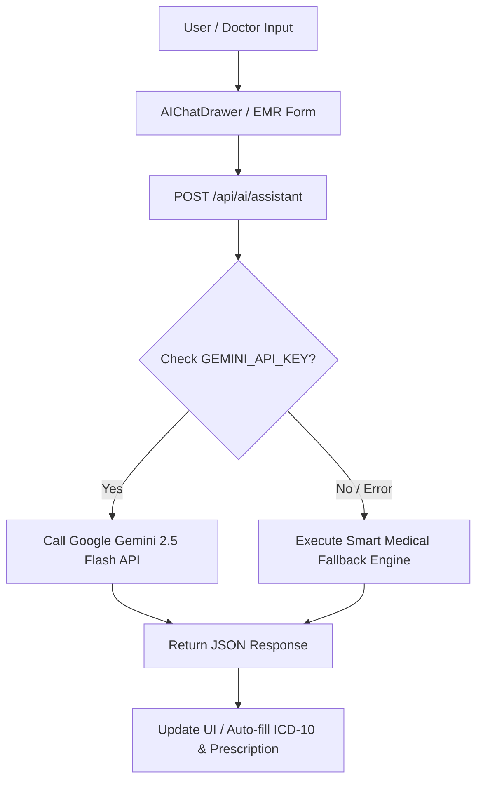

# 🏗️ Technical Design Requirement (TDR)

## Arsitektur Teknis Sistem Informasi Praktik Dokter Mandiri, EMR & AI Copilot

- **Versi Dokumen**: 1.1.0  
- **Lead Architect / Developer**: **Muhammad Irfan**  
- **Tanggal Update**: 4 Agustus 2026  

---

## 🛠️ 1. Stack Teknologi & Spesifikasi Perangkat Lunak

| Lapisan (Layer) | Teknologi / Library | Versi | Alasan Pemilihan |
| :--- | :--- | :--- | :--- |
| **Framework Utama** | Next.js (App Router) | `16.2.11` | Server-side rendering cepat, Turbopack build engine, file-system routing. |
| **Bahasa Pemrograman**| TypeScript | `5.x` | Type-safety ketat, mencegah runtime type bugs pada kalkulasi medis & tagihan. |
| **UI Library & Core** | React | `19.2.4` | Declarative UI, hooks, and React 19 performance optimizations. |
| **Styling & Design System**| Tailwind CSS | `v4` | Styling utilitas responsif modern, custom dark/light mode tokens. |
| **AI Engine** | Google Gemini API + Smart Fallback | Gemini 2.5 Flash | Rekomendasi ICD-10, saran dosis obat & triase gejala. |
| **Automated Testing** | Playwright E2E | `1.50+` | Multi-browser testing suite (Chromium & Mobile Chrome). |
| **CI/CD Pipeline** | GitHub Actions | `v4` | Automated E2E testing pada setiap Push & Pull Request. |
| **Ikonografi** | Lucide React | `1.26.0` | Ikon medis & UI SVG yang bersih dan konsisten. |
| **Deployment & Hosting**| Vercel Cloud Platform | Production | CI/CD otomatis dari GitHub, Edge CDN global, SSL gratis. |

---

## 📁 2. Struktur Proyek & Arsitektur Kode

```text
clinic-management-system/
├── .github/
│   └── workflows/
│       └── e2e.yml            # GitHub Actions Automated E2E Testing Pipeline
├── docs/                      # Dokumentasi Sistem (PRD, TDR, User Guide, Roadmap)
│   ├── PRD.md
│   ├── TDR.md
│   ├── USER_GUIDE.md
│   └── SAAS_ROADMAP.md
├── tests/
│   └── e2e/
│       └── clinic-workflow.spec.ts # Playwright E2E Multi-Browser Specs
├── public/                    # Aset Statis Website
├── src/
│   ├── app/                   # Next.js 16 App Router Routes
│   │   ├── api/
│   │   │   └── ai/
│   │   │       └── assistant/route.ts # MedAssistant AI Route Handler
│   │   ├── page.tsx           # Dashboard Overview
│   │   ├── antrean/page.tsx   # Pendaftaran & Antrean Pasien
│   │   ├── rekam-medis/page.tsx# EMR Dokter (+ ✨ AI Suggest ICD-10 Button)
│   │   ├── surat/page.tsx     # Cetak Surat Sehat, Rujukan RS & Sakit
      │   ├── kasir/page.tsx     # Kasir & Pembayaran Struk
│   │   ├── master/
│   │   │   ├── obat/page.tsx  # Master Data Obat
│   │   │   └── tarif/page.tsx # Master Data Tarif Layanan
│   │   ├── settings/page.tsx  # Pengaturan Profil Dokter & Kop Surat
│   │   ├── laporan/page.tsx   # Laporan & Rekapitulasi Keuangan
│   │   ├── layout.tsx         # Root Layout dengan Provider & AIChatDrawer
│   │   └── globals.css        # Tailwind CSS Global Rules & Media Print Styles
│   ├── components/
│   │   ├── ai/
│   │   │   └── AIChatDrawer.tsx # Floating AI Copilot & Chatbot Widget
│   │   ├── layout/
│   │   │   ├── Navbar.tsx     # Header Brand, Date Display & Demo Seeder
│   │   │   ├── Sidebar.tsx    # Desktop Sidebar Navigation (lg:flex)
│   │   │   └── MobileNav.tsx  # Hamburger Toggle, Drawer Overlay & Mobile Bottom Nav Bar
│   │   └── ui/                # Base Design System Components
│   │       ├── Badge.tsx
│   │       ├── Button.tsx
│   │       ├── Card.tsx
│   │       ├── DemoSeederButton.tsx # ⚡ 1-Click Instant Demo Data Generator
│   │       ├── Input.tsx
│   │       └── Modal.tsx
│   └── lib/
│       ├── store/
│       │   ├── ClinicContext.tsx # Central React Context State Manager
│       │   └── clinic-store.ts  # Initial Mock Seed Data
│       ├── types/
│       │   └── clinic.ts      # TypeScript Models & Interfaces
│       └── utils.ts           # Utility Functions
├── playwright.config.ts       # Konfigurasi Playwright Test Runner
├── LICENSE                    # Hak Cipta © 2026 Muhammad Irfan
├── README.md                  # Dokumentasi Utama GitHub
└── package.json
```

---

## 🤖 3. Arsitektur AI Assistant & Smart Fallback Engine



1. **Endpoint**: `POST /api/ai/assistant`
2. **Payload Request**:
   ```json
   {
     "type": "icd10_suggest",
     "prompt": "Demam tinggi 3 hari, pusing, nyeri tenggorokan",
     "patientContext": { "anamnesis": "Demam...", "gender": "L" }
   }
   ```
3. **Fallback Logic**: Jika `GEMINI_API_KEY` tidak ditemukan di environment variables, fungsi `generateSmartFallbackReply()` secara otomatis memetakan keluhan pasien ke kode ICD-10 Indonesia yang umum (seperti `A90 Dengue Fever`, `J00 Common Cold`, `K29.7 Gastritis`) sehingga sistem 100% reliabel.

---

## 🧪 4. Arsitektur Automated E2E Testing (Playwright)

- **Framework**: `@playwright/test`
- **Config**: `playwright.config.ts` dikonfigurasi dengan `webServer` otomatis (`npm run dev` di port `3000`).
- **Target Browser**:
  - `chromium`: Desktop Chrome (1280x720)
  - `Mobile Chrome`: Pixel 5 Viewport (393x851)
- **CI Automation**: Runs on GitHub Actions runner (`ubuntu-latest`) pada setiap push ke `main`/`master`.

---

## 🚀 5. CI/CD & Deployment Pipeline

- **Repository**: GitHub (`https://github.com/iarisaldy/clinic-management-system`)
- **Hosting Platform**: Vercel Cloud Platform
- **Triggers**: Push ke branch `main` memicu Vercel Build Worker + GitHub Actions E2E Job.
- **Build Verification**: `npm run build` mengeksekusi kompilasi TypeScript dan Next.js static page generation.
